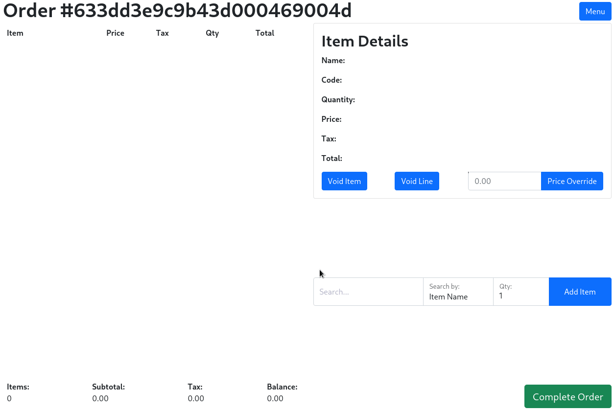
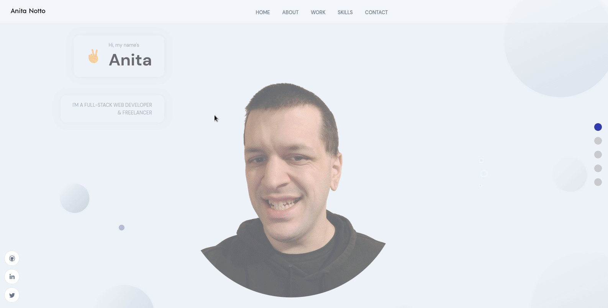
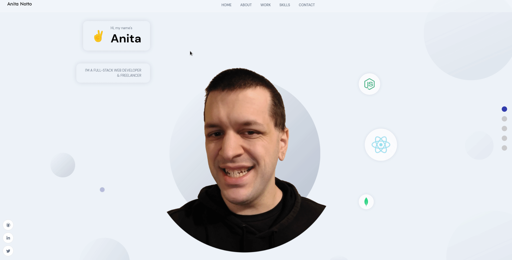

<h1 align="center">Howdy ✌️, I'm Anita</h1>
<h3 align="center">A full stack web dev from Charlottesville, VA</h3>
<pre align="center">
&nbsp;
&nbsp;

🚀  I'm currently working on [a POS system for small businesses.](http://github.com/anitanotto/magical-merchant)
&nbsp;
🖥️  See my portfolio at [http://anitanotto.com](http://anitanotto.com)
&nbsp;
🤝  I'm open to collaborating on FOSS & FGC projects.

</pre>

<h1 align="center" dir="auto"><a id="user-content-projects" class="anchor" aria-hidden="true" href="#projects"><svg class="octicon octicon-link" viewBox="0 0 16 16" version="1.1" width="16" height="16" aria-hidden="true"><path fill-rule="evenodd" d="M7.775 3.275a.75.75 0 001.06 1.06l1.25-1.25a2 2 0 112.83 2.83l-2.5 2.5a2 2 0 01-2.83 0 .75.75 0 00-1.06 1.06 3.5 3.5 0 004.95 0l2.5-2.5a3.5 3.5 0 00-4.95-4.95l-1.25 1.25zm-4.69 9.64a2 2 0 010-2.83l2.5-2.5a2 2 0 012.83 0 .75.75 0 001.06-1.06 3.5 3.5 0 00-4.95 0l-2.5 2.5a3.5 3.5 0 004.95 4.95l1.25-1.25a.75.75 0 00-1.06-1.06l-1.25 1.25a2 2 0 01-2.83 0z"></path></svg></a>My Projects</h1>
<table>
  <tbody><tr>
    <td width="50%" valign="top">
      <h3 align="center" dir="auto"><a id="user-content-magicalmerchant" class="anchor" aria-hidden="true" href="#magicalmerchant"><svg class="octicon octicon-link" viewBox="0 0 16 16" version="1.1" width="16" height="16" aria-hidden="true"><path fill-rule="evenodd" d="M7.775 3.275a.75.75 0 001.06 1.06l1.25-1.25a2 2 0 112.83 2.83l-2.5 2.5a2 2 0 01-2.83 0 .75.75 0 00-1.06 1.06 3.5 3.5 0 004.95 0l2.5-2.5a3.5 3.5 0 00-4.95-4.95l-1.25 1.25zm-4.69 9.64a2 2 0 010-2.83l2.5-2.5a2 2 0 012.83 0 .75.75 0 001.06-1.06 3.5 3.5 0 00-4.95 0l-2.5 2.5a3.5 3.5 0 004.95 4.95l1.25-1.25a.75.75 0 00-1.06-1.06l-1.25 1.25a2 2 0 01-2.83 0z"></path></svg></a>Magical Merchant</h3>
         
        <animated-image data-catalyst="" style="width: 100%;">
      
        <a data-target="animated-image.replacedLink" class="AnimatedImagePlayer-images" href="http://magical-merchant.herokuapp.com/" target="_blank">
          
            
          <canvas class="AnimatedImagePlayer-stillImage" aria-hidden="true" width="396" height="192"></canvas>
        </a>
        <button data-target="animated-image.imageButton" class="AnimatedImagePlayer-images" tabindex="-1" aria-label="Play Point of Sale App"></button>
        
          <button data-target="animated-image.playButton" class="AnimatedImagePlayer-button" aria-label="Play Travel App">
            <svg aria-hidden="true" focusable="false" class="octicon icon-play" width="16" height="16" viewBox="0 0 16 16" fill="none" xmlns="http://www.w3.org/2000/svg">
              <path d="M4 13.5427V2.45734C4 1.82607 4.69692 1.4435 5.2295 1.78241L13.9394 7.32507C14.4334 7.63943 14.4334 8.36057 13.9394 8.67493L5.2295 14.2176C4.69692 14.5565 4 14.1739 4 13.5427Z">
            </path></svg>
            <svg aria-hidden="true" focusable="false" class="octicon icon-pause" width="16" height="16" viewBox="0 0 16 16" xmlns="http://www.w3.org/2000/svg">
              <rect x="4" y="2" width="3" height="12" rx="1"></rect>
              <rect x="9" y="2" width="3" height="12" rx="1"></rect>
            </svg>
          </button>
          <a data-target="animated-image.openButton" aria-label="Open Point of Sale App in new window" class="AnimatedImagePlayer-button" href="http://magical-merchant.herokuapp.com/" target="_blank">
            <svg aria-hidden="true" class="octicon" xmlns="http://www.w3.org/2000/svg" viewBox="0 0 16 16" width="16" height="16">
              <path fill-rule="evenodd" d="M10.604 1h4.146a.25.25 0 01.25.25v4.146a.25.25 0 01-.427.177L13.03 4.03 9.28 7.78a.75.75 0 01-1.06-1.06l3.75-3.75-1.543-1.543A.25.25 0 0110.604 1zM3.75 2A1.75 1.75 0 002 3.75v8.5c0 .966.784 1.75 1.75 1.75h8.5A1.75 1.75 0 0014 12.25v-3.5a.75.75 0 00-1.5 0v3.5a.25.25 0 01-.25.25h-8.5a.25.25 0 01-.25-.25v-8.5a.25.25 0 01.25-.25h3.5a.75.75 0 000-1.5h-3.5z"></path>
            </svg>
          </a>
        
      </animated-image>
         
        

    
  
      

        
<strong>Javascript, Bootstrap, Sass, Node.js, &amp; Express.js</strong> - A web based point of sale system that your small business can run anywhere and take card payments without any extra hardware - just your phone or computer.

    </td>
    <td width="50%" valign="top">
      <h3 align="center" dir="auto"><a id="user-content-guilty-gear-api" class="anchor" aria-hidden="true" href="#guilty-gear-api"><svg class="octicon octicon-link" viewBox="0 0 16 16" version="1.1" width="16" height="16" aria-hidden="true"><path fill-rule="evenodd" d="M7.775 3.275a.75.75 0 001.06 1.06l1.25-1.25a2 2 0 112.83 2.83l-2.5 2.5a2 2 0 01-2.83 0 .75.75 0 00-1.06 1.06 3.5 3.5 0 004.95 0l2.5-2.5a3.5 3.5 0 00-4.95-4.95l-1.25 1.25zm-4.69 9.64a2 2 0 010-2.83l2.5-2.5a2 2 0 012.83 0 .75.75 0 001.06-1.06 3.5 3.5 0 00-4.95 0l-2.5 2.5a3.5 3.5 0 004.95 4.95l1.25-1.25a.75.75 0 00-1.06-1.06l-1.25 1.25a2 2 0 01-2.83 0z"></path></svg></a>Guilty Gear Strive Frame Data API</h3>
         
      <animated-image data-catalyst="" style="width: 100%;">
      
        <a data-target="animated-image.replacedLink" class="AnimatedImagePlayer-images" href="https://ggst-framedata.herokuapp.com/" target="_blank">
          
            
          <canvas class="AnimatedImagePlayer-stillImage" aria-hidden="true" width="396" height="192"></canvas>
        </a>
        <button data-target="animated-image.imageButton" class="AnimatedImagePlayer-images" tabindex="-1" aria-label="Play Guilty Gear API"></button>
        
          <button data-target="animated-image.playButton" class="AnimatedImagePlayer-button" aria-label="Play Guilty Gear API">
            <svg aria-hidden="true" focusable="false" class="octicon icon-play" width="16" height="16" viewBox="0 0 16 16" fill="none" xmlns="http://www.w3.org/2000/svg">
              <path d="M4 13.5427V2.45734C4 1.82607 4.69692 1.4435 5.2295 1.78241L13.9394 7.32507C14.4334 7.63943 14.4334 8.36057 13.9394 8.67493L5.2295 14.2176C4.69692 14.5565 4 14.1739 4 13.5427Z">
            </path></svg>
            <svg aria-hidden="true" focusable="false" class="octicon icon-pause" width="16" height="16" viewBox="0 0 16 16" xmlns="http://www.w3.org/2000/svg">
              <rect x="4" y="2" width="3" height="12" rx="1"></rect>
              <rect x="9" y="2" width="3" height="12" rx="1"></rect>
            </svg>
          </button>
          <a data-target="animated-image.openButton" aria-label="Open Guilty Gear API in new window" class="AnimatedImagePlayer-button" href="https://ggst-framedata.herokuapp.com/" target="_blank">
            <svg aria-hidden="true" class="octicon" xmlns="http://www.w3.org/2000/svg" viewBox="0 0 16 16" width="16" height="16">
              <path fill-rule="evenodd" d="M10.604 1h4.146a.25.25 0 01.25.25v4.146a.25.25 0 01-.427.177L13.03 4.03 9.28 7.78a.75.75 0 01-1.06-1.06l3.75-3.75-1.543-1.543A.25.25 0 0110.604 1zM3.75 2A1.75 1.75 0 002 3.75v8.5c0 .966.784 1.75 1.75 1.75h8.5A1.75 1.75 0 0014 12.25v-3.5a.75.75 0 00-1.5 0v3.5a.25.25 0 01-.25.25h-8.5a.25.25 0 01-.25-.25v-8.5a.25.25 0 01.25-.25h3.5a.75.75 0 000-1.5h-3.5z"></path>
            </svg>
          </a>
        
      </animated-image>
         
        

  
  
      

        
<strong>EJS, Node.js, & Express.js</strong> - A REST API serving Guilty Gear Strive Frame Data, plus a script to web scrape data when the game has updated and an app utilizing the API to analyze the data.

    </td>
  </tr>
  <tr>
    <td width="50%" valign="top">
      <h3 align="center" dir="auto"><a id="user-content-anitanottocom" class="anchor" aria-hidden="true" href="#anitanottocom"><svg class="octicon octicon-link" viewBox="0 0 16 16" version="1.1" width="16" height="16" aria-hidden="true"><path fill-rule="evenodd" d="M7.775 3.275a.75.75 0 001.06 1.06l1.25-1.25a2 2 0 112.83 2.83l-2.5 2.5a2 2 0 01-2.83 0 .75.75 0 00-1.06 1.06 3.5 3.5 0 004.95 0l2.5-2.5a3.5 3.5 0 00-4.95-4.95l-1.25 1.25zm-4.69 9.64a2 2 0 010-2.83l2.5-2.5a2 2 0 012.83 0 .75.75 0 001.06-1.06 3.5 3.5 0 00-4.95 0l-2.5 2.5a3.5 3.5 0 004.95 4.95l1.25-1.25a.75.75 0 00-1.06-1.06l-1.25 1.25a2 2 0 01-2.83 0z"></path></svg></a>AnitaNotto.com</h3>
       
        <animated-image data-catalyst="" style="width: 100%;">
      
        <a data-target="animated-image.replacedLink" class="AnimatedImagePlayer-images" href="https://anitanotto.com/" target="_blank">
          
            
          <canvas class="AnimatedImagePlayer-stillImage" aria-hidden="true" width="396" height="192"></canvas>
        </a>
        <button data-target="animated-image.imageButton" class="AnimatedImagePlayer-images" tabindex="-1" aria-label="Play Portfolio"></button>
        
          <button data-target="animated-image.playButton" class="AnimatedImagePlayer-button" aria-label="Play Portfolio">
            <svg aria-hidden="true" focusable="false" class="octicon icon-play" width="16" height="16" viewBox="0 0 16 16" fill="none" xmlns="http://www.w3.org/2000/svg">
              <path d="M4 13.5427V2.45734C4 1.82607 4.69692 1.4435 5.2295 1.78241L13.9394 7.32507C14.4334 7.63943 14.4334 8.36057 13.9394 8.67493L5.2295 14.2176C4.69692 14.5565 4 14.1739 4 13.5427Z">
            </path></svg>
            <svg aria-hidden="true" focusable="false" class="octicon icon-pause" width="16" height="16" viewBox="0 0 16 16" xmlns="http://www.w3.org/2000/svg">
              <rect x="4" y="2" width="3" height="12" rx="1"></rect>
              <rect x="9" y="2" width="3" height="12" rx="1"></rect>
            </svg>
          </button>
          <a data-target="animated-image.openButton" aria-label="Open Portfolio in new window" class="AnimatedImagePlayer-button" href="https://anitanotto.com/" target="_blank">
            <svg aria-hidden="true" class="octicon" xmlns="http://www.w3.org/2000/svg" viewBox="0 0 16 16" width="16" height="16">
              <path fill-rule="evenodd" d="M10.604 1h4.146a.25.25 0 01.25.25v4.146a.25.25 0 01-.427.177L13.03 4.03 9.28 7.78a.75.75 0 01-1.06-1.06l3.75-3.75-1.543-1.543A.25.25 0 0110.604 1zM3.75 2A1.75 1.75 0 002 3.75v8.5c0 .966.784 1.75 1.75 1.75h8.5A1.75 1.75 0 0014 12.25v-3.5a.75.75 0 00-1.5 0v3.5a.25.25 0 01-.25.25h-8.5a.25.25 0 01-.25-.25v-8.5a.25.25 0 01.25-.25h3.5a.75.75 0 000-1.5h-3.5z"></path>
            </svg>
          </a>
        
      </animated-image>
       
        

  
  
      

        
<strong>React, SASS, &amp; Sanity.io</strong> - Portfolio Site including links to my projects and ways to get in contact with me.

    </td>
    <td width="50%" valign="top">
      <h3 align="center" dir="auto"><a id="user-content-gallery15" class="anchor" aria-hidden="true" href="#gallery15"><svg class="octicon octicon-link" viewBox="0 0 16 16" version="1.1" width="16" height="16" aria-hidden="true"><path fill-rule="evenodd" d="M7.775 3.275a.75.75 0 001.06 1.06l1.25-1.25a2 2 0 112.83 2.83l-2.5 2.5a2 2 0 01-2.83 0 .75.75 0 00-1.06 1.06 3.5 3.5 0 004.95 0l2.5-2.5a3.5 3.5 0 00-4.95-4.95l-1.25 1.25zm-4.69 9.64a2 2 0 010-2.83l2.5-2.5a2 2 0 012.83 0 .75.75 0 001.06-1.06 3.5 3.5 0 00-4.95 0l-2.5 2.5a3.5 3.5 0 004.95 4.95l1.25-1.25a.75.75 0 00-1.06-1.06l-1.25 1.25a2 2 0 01-2.83 0z"></path></svg></a>The Gallery on 15</h3>
         
        <animated-image data-catalyst="" style="width: 100%;">
      
        <a data-target="animated-image.replacedLink" class="AnimatedImagePlayer-images" href="https://anitanotto.github.io/the-gallery-on-15/" target="_blank">
          
            
          <canvas class="AnimatedImagePlayer-stillImage" aria-hidden="true" width="396" height="192"></canvas>
        </a>
        <button data-target="animated-image.imageButton" class="AnimatedImagePlayer-images" tabindex="-1" aria-label="Play The Gallery on 15"></button>
        
          <button data-target="animated-image.playButton" class="AnimatedImagePlayer-button" aria-label="Play Matching Cards">
            <svg aria-hidden="true" focusable="false" class="octicon icon-play" width="16" height="16" viewBox="0 0 16 16" fill="none" xmlns="http://www.w3.org/2000/svg">
              <path d="M4 13.5427V2.45734C4 1.82607 4.69692 1.4435 5.2295 1.78241L13.9394 7.32507C14.4334 7.63943 14.4334 8.36057 13.9394 8.67493L5.2295 14.2176C4.69692 14.5565 4 14.1739 4 13.5427Z">
            </path></svg>
            <svg aria-hidden="true" focusable="false" class="octicon icon-pause" width="16" height="16" viewBox="0 0 16 16" xmlns="http://www.w3.org/2000/svg">
              <rect x="4" y="2" width="3" height="12" rx="1"></rect>
              <rect x="9" y="2" width="3" height="12" rx="1"></rect>
            </svg>
          </button>
          <a data-target="animated-image.openButton" aria-label="Open The Gallery on 15 in new window" class="AnimatedImagePlayer-button" href="https://anitanotto.github.io/the-gallery-on-15/" target="_blank">
            <svg aria-hidden="true" class="octicon" xmlns="http://www.w3.org/2000/svg" viewBox="0 0 16 16" width="16" height="16">
              <path fill-rule="evenodd" d="M10.604 1h4.146a.25.25 0 01.25.25v4.146a.25.25 0 01-.427.177L13.03 4.03 9.28 7.78a.75.75 0 01-1.06-1.06l3.75-3.75-1.543-1.543A.25.25 0 0110.604 1zM3.75 2A1.75 1.75 0 002 3.75v8.5c0 .966.784 1.75 1.75 1.75h8.5A1.75 1.75 0 0014 12.25v-3.5a.75.75 0 00-1.5 0v3.5a.25.25 0 01-.25.25h-8.5a.25.25 0 01-.25-.25v-8.5a.25.25 0 01.25-.25h3.5a.75.75 0 000-1.5h-3.5z"></path>
            </svg>
          </a>
        
      </animated-image>
         
        

  
  <a href="https://anitanotto.github.io/the-gallery-on-15" rel="nofollow">
    <!--
  </a>-->
      

        
<strong>HTML5, CSS3, &amp; Javascript</strong> - A local antique and art store that has been in business for over 30 years commissioned me to build their first web page.

    </td>
  </tr>
</tbody></table>

<h3 align="center">My Skills</h3>

<h3 align="center">Connect With Me on  & </h3>

&nbsp;&nbsp;&nbsp;&nbsp;&nbsp;&nbsp;

