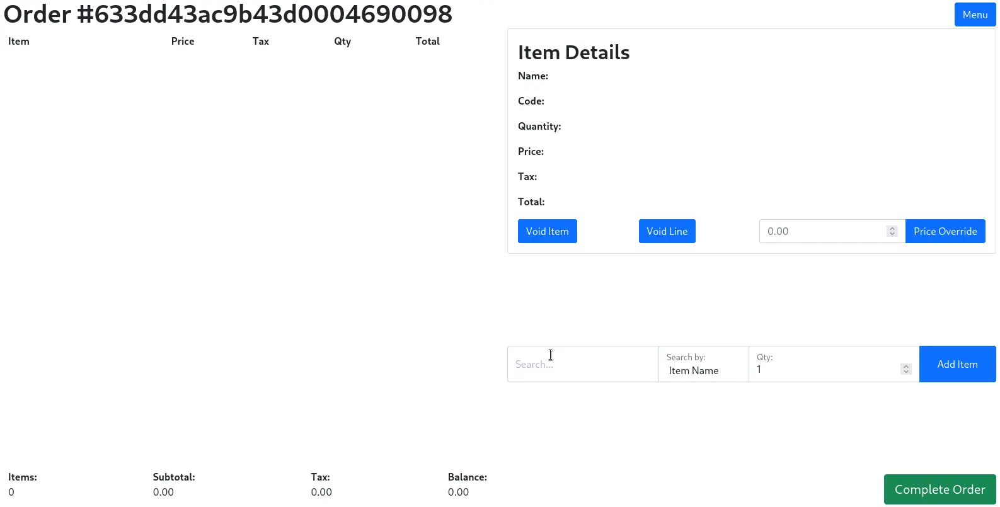
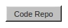
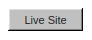
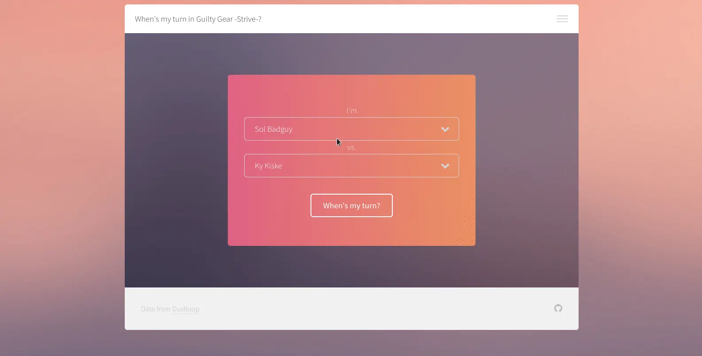
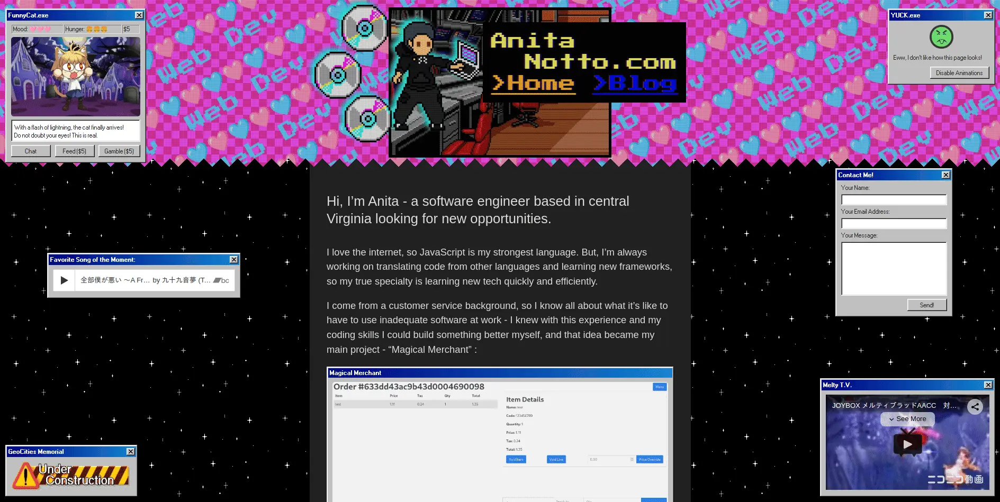
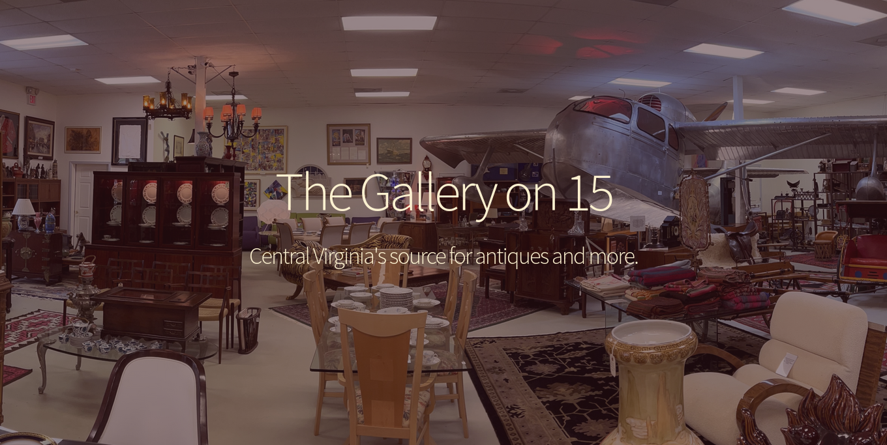

 

Hi, I'm Anita - I'm a full stack web dev from Charlottesville, VA.

I love the internet, so, I'm always learning to use new tech that I can use in building my next website. My main project is <a href="https://magical-merchant.onrender.com/">Magical Merchant</a> - I come from a customer service background so I wanted to build something better than the horrible software I was forced to use for those jobs. I'm looking forward to learning a new framework to take it from the MVP stage to being more efficient in situations where users have a poor internet connection.

<table style="width:1012px;">
  <th colspan="2">My Projects</th>
  <tr width="100%">
    <td width="50%" style="text-align: center;">
      <h3 align="center">Magical Merchant</h3>
      
      
A web-based point-of-sale system that your small business can run anywhere and even take card payments with only a phone or computer - no extra hardware!

      
Tech used: Bootstrap, Sass, Node.js, & Express.js

      

      
      
      

    </td>
    <td width="50%" style="text-align: center;">
      <h3 align="center">Guilty Gear Strive Frame Data API</h3>
      
      
A Restful API serving Guilty Gear Strive frame data, plus a script to scrape updated data and an app that pulls data from the API and analyzes it.

      
Tech used: EJS, Sass, Node.js, & Express.js

      

      
      
      

    </td>
  </tr>
  <tr width="100%">
    <td width="50%" style="text-align: center;">
      <h3 align="center">AnitaNotto.com</h3>
      
      
My portfolio and blog website showcasing what I'm building and stuff I'm learning.

      
Tech used: HTML5, CSS3, JavaScript, & Jekyll

      

      
      
      

    </td>
    <td width="50%" style="text-align: center;">
      <h3 align="center">The Gallery on 15</h3>
      
      
A local antique and art store that has been in business for over 30 years commissioned me to build their web page.

      
Tech used: HTML5, CSS3, & JavaScript

      

      
      

    </td>
  </tr>
</table>

Every day, I complete at least one problem on Codewars/LeetCode & push more code to GitHub to help keep my skills sharp.

<h3 align="center">Connect With Me on  & </h3>

